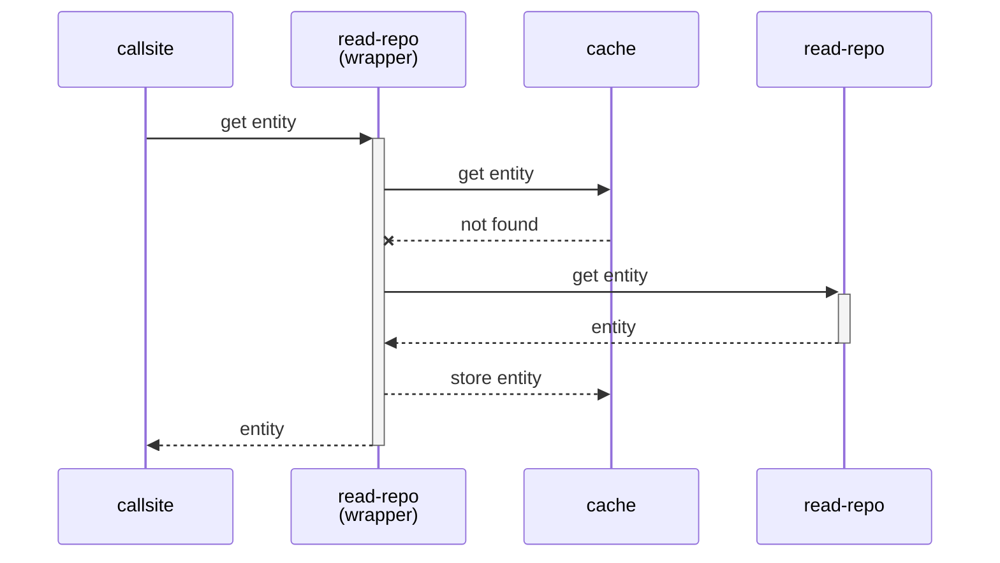
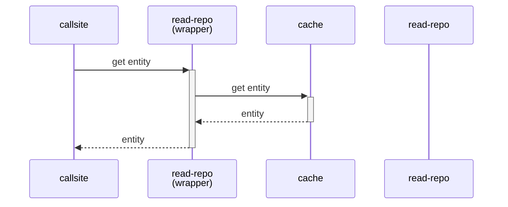
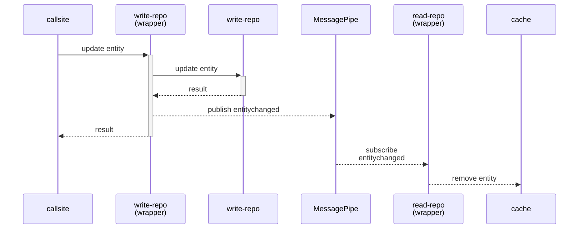

# Caching

- [Caching](#caching)
  - [Sample](#sample)
  - [Sequence diagram](#sequence-diagram)
    - [If the entity is not cached](#if-the-entity-is-not-cached)
    - [If the entity is cached](#if-the-entity-is-cached)
    - [When the entity is updated](#when-the-entity-is-updated)
  - [Usage](#usage)

Adds read caching capability to the repository.

## Sample

```c#
// create repositories and add caching functionality.
using var writeRepo = new SampleWriteRepository().WithCache(x => x.ID);
using var readRepo = new SampleReadRepository().WithCache(x => x.ID);

// insert a entity with ID 1.
var entity1 = new SampleEntity() { ID = 1, Code = "001", Name = "entity1" };
writeRepo.Insert(entity1);

// get the entity with ID 1.
// The created instance is cached.
var found1 = readRepo.Get(1);

// get the entity with ID 1 again.
// The cached instance will be returned.
var found2 = readRepo.Get(1);
```

## Sequence diagram

### If the entity is not cached

The entity corresponding to the key is retrieved from the repository.



### If the entity is cached

If a cached entity corresponds to the key, it is returned without accessing the repository.



### When the entity is updated

If the updated entity is in the cache, remove the key and entity from the cache. 
When an entity is updated, the read-only repository is notified. Messaging between repositories is done by [MessagePipe](https://github.com/Cysharp/MessagePipe).



## Usage

To add caching to a repository, simply call the WithCache method that has been added to the Repository interface.

Added extension methods to the following interfaces:

* IReadDataRepository&lt;TEntity, TKey&gt;
* IReadDataRepositoryWithContext&lt;TEntity, TKey, TContext&gt;
* IReadDataRepositoryWithUniqueKey&lt;TEntity, TPrimaryKey, TUniqueKey&gt;
* IReadDataRepositoryWithUniqueKeyWithContext&lt;TEntity, TPrimaryKey, TUniqueKey, TContext&gt;
* IAsyncReadDataRepository&lt;TEntity, TKey&gt;
* IAsyncReadDataRepositoryWithContext&lt;TEntity, TKey, TContext&gt;
* IAsyncReadDataRepositoryWithUniqueKey&lt;TEntity, TPrimaryKey, TUniqueKey&gt;
* IAsyncReadDataRepositoryWithUniqueKeyWithContext&lt;TEntity, TPrimaryKey, TUniqueKey, TContext&gt;

The following code shows the list of extension methods for the IReadDataRepository&lt;TEntity, TKey&gt; interface. The same is true for other interfaces.

* Use an instance of a type that implements the IEntityCache&lt;TKey, TEntity&gt; interface or the IDictionary&lt;TKey, TEntity&gt; interface as the cache. Specifies a value that indicates whether the cache should be disposed when the repository is disposed.

* Specifies a method to get the key from an entity if the entity type does not implement the IHasKey&lt;TKey&gt; interface.

```c#
// A ConcurrentDictionary<TKey, TEntity> is generated internally.
IReadDataRepository<TEntity, TKey> repo = CreateRepository();
repo = repo.WithCache();

// specify a cache that implements the IEntityCache<TKey, TEntity> interface.
IReadDataRepository<TEntity, TKey> repo = CreateRepository();
IEntityCache<TKey, TEntity> cache = CreateCache();
bool disposableCache = true;
repo = repo.WithCache(cache, disposableCache);

// specify a cache that implements the IDictionary<TKey, TEntity> interface.
IReadDataRepository<TEntity, TKey> repo = CreateRepository();
IDictionary<TKey, TEntity> cache = CreateCache();
bool disposableCache = true;
repo = repo.WithCache(cache, disposableCache);

// If TEntity does not implement the IHasKey<TKey> interface, specify a method to get the key.

// A ConcurrentDictionary<TKey, TEntity> is generated internally.
IReadDataRepository<TEntity, TKey> repo = CreateRepository();
Func<TEntity, TKey> keyGetter = x => x.ID;
repo = repo.WithCache(keyGetter);

// specify a cache that implements the IEntityCache<TKey, TEntity> interface.
IReadDataRepository<TEntity, TKey> repo = CreateRepository();
Func<TEntity, TKey> keyGetter = x => x.ID;
IEntityCache<TKey, TEntity> cache = CreateCache();
bool disposableCache = true;
repo = repo.WithCache(keyGetter, cache, disposableCache);

// specify a cache that implements the IDictionary<TKey, TEntity> interface.
IReadDataRepository<TEntity, TKey> repo = CreateRepository();
Func<TEntity, TKey> keyGetter = x => x.ID;
IDictionary<TKey, TEntity> cache = CreateCache();
bool disposableCache = true;
repo = repo.WithCache(keyGetter, cache, disposableCache);
```

The WithCache method on write repository adds the ability to notify read-only repository that an entity has been updated. It is not a write cache.

Added extension methods to the following interfaces:

* IWriteDataRepository&lt;TEntity&gt;
* IWriteDataRepositoryWithContext&lt;TEntity, TContext&gt;
* IAsyncWriteDataRepository&lt;TEntity&gt;
* IAsyncWriteDataRepositoryWithContext&lt;TEntity, TContext&gt;

```c#
IWriteDataRepository<TEntity> repo = CreateRepository();
Func<TEntity, TKey> keyGetter = x => x.ID;
repo = repo.WithCache(keyGetter);
```

