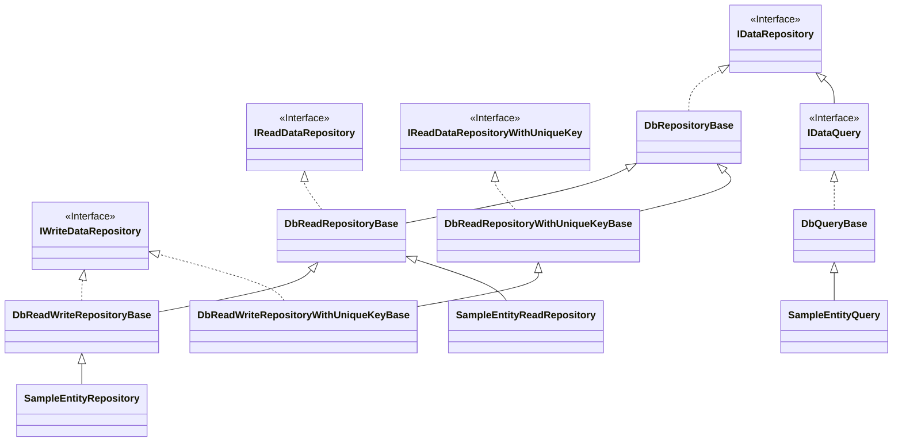
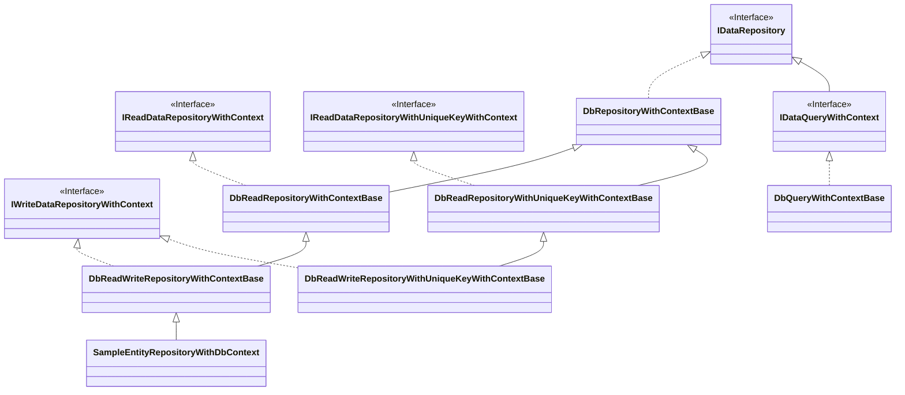

# Implementing database repositories

- [Implementing database repositories](#implementing-database-repositories)
  - [Sample](#sample)
    - [Data Read Repository](#data-read-repository)
    - [Data Read/Write Repository](#data-readwrite-repository)
      - [Ambient Transaction](#ambient-transaction)
      - [Explicit Transaction](#explicit-transaction)
    - [Data Query Repository](#data-query-repository)
  - [Class diagram](#class-diagram)
  - [Base classes](#base-classes)
    - [DbRepositoryBase{TEntity} Class](#dbrepositorybasetentity-class)
    - [DbRepositoryWithContextBase{TEntity, TContext} Class](#dbrepositorywithcontextbasetentity-tcontext-class)
  - [Basic repositories](#basic-repositories)
    - [DbReadRepositoryBase{TEntity, TKey} Class](#dbreadrepositorybasetentity-tkey-class)
    - [DbReadRepositoryWithUniqueKeyBase{TEntity, TPrimaryKey, TUniqueKey} Class](#dbreadrepositorywithuniquekeybasetentity-tprimarykey-tuniquekey-class)
    - [DbReadWriteRepositoryBase{TEntity, TKey} Class](#dbreadwriterepositorybasetentity-tkey-class)
    - [DbReadWriteRepositoryWithUniqueKeyBase{TEntity, TPrimaryKey, TUniqueKey} Class](#dbreadwriterepositorywithuniquekeybasetentity-tprimarykey-tuniquekey-class)
  - [Repositories that use the context](#repositories-that-use-the-context)
    - [DbReadRepositoryWithContextBase{TEntity, TKey, TContext} Class](#dbreadrepositorywithcontextbasetentity-tkey-tcontext-class)
    - [DbReadRepositoryWithUniqueKeyWithContextBase{TEntity, TPrimaryKey, TUniqueKey, TContext} Class](#dbreadrepositorywithuniquekeywithcontextbasetentity-tprimarykey-tuniquekey-tcontext-class)
    - [DbReadWriteRepositoryWithContextBase{TEntity, TKey, TContext} Class](#dbreadwriterepositorywithcontextbasetentity-tkey-tcontext-class)
    - [DbReadWriteRepositoryWithUniqueKeyWithContextBase{TEntity, TPrimaryKey, TUniqueKey, TContext} Class](#dbreadwriterepositorywithuniquekeywithcontextbasetentity-tprimarykey-tuniquekey-tcontext-class)


## Sample

### Data Read Repository

This is a repository that retrieves entities by primary key.

```c#
// create a repository.
using var repo = new SampleEntityReadRepository(CreateConnection, true);

// get the entity with ID 1.
var entity = repo.Get(1);

if (entity != null)
{
    Console.WriteLine($"Id:{entity.Id}, Code:{entity.Code}, Name:{entity.Name}");
}
```

<details><summary>Implementing the SampleEntityReadRepository class</summary>

```c#
/// <summary>
/// Provides methods to read SampleEntity from the database.
/// </summary>
internal class SampleEntityReadRepository : DbReadRepositoryBase<SampleEntity, int>
{
    /// <summary>
    /// Initializes a new instance of the <see cref="SampleEntityReadRepository"/> class.
    /// </summary>
    /// <param name="connectionActivator">The method to activate a connection.</param>
    /// <param name="useTransactionScope">A value that indicates whether to use ambient transactions using TransactionScope.</param>
    public SampleEntityReadRepository(Func<IDbConnection> connectionActivator, bool useTransactionScope)
        : base(connectionActivator, useTransactionScope)
    {
    }

    /// <summary>
    /// Gets the entity corresponding to the specified key.
    /// </summary>
    /// <param name="commandActivator">The method to activate a new command.</param>
    /// <param name="key">The key.</param>
    /// <returns>The entity.</returns>
    protected override SampleEntity? Get(Func<IDbCommand> commandActivator, int key)
    {
        return GetSampleEntities(commandActivator, new[] { key }).FirstOrDefault();
    }

    /// <summary>
    /// Gets the entities corresponding to the specified keys.
    /// </summary>
    /// <param name="commandActivator">The method to activate a new command.</param>
    /// <param name="keys">The keys.</param>
    /// <returns>The entities.</returns>
    protected override IEnumerable<SampleEntity> GetRange(Func<IDbCommand> commandActivator, IEnumerable<int> keys)
    {
        return GetSampleEntities(commandActivator, keys);
    }

    /// <summary>
    /// Gets all entities.
    /// </summary>
    /// <param name="commandActivator">The method to activate a new command.</param>
    /// <returns>The entities.</returns>
    protected override IEnumerable<SampleEntity> GetAll(Func<IDbCommand> commandActivator)
    {
        return GetSampleEntities(commandActivator, Array.Empty<int>());
    }

    /// <summary>
    /// Gets all keys.
    /// </summary>
    /// <param name="commandActivator">The method to activate a new command.</param>
    /// <returns>The keys.</returns>
    protected override IEnumerable<int> GetAllKeys(Func<IDbCommand> commandActivator)
    {
        using var command = commandActivator();

        var sql = new StringBuilder();

        sql.AppendLine("select");
        sql.AppendLine("ID");
        sql.AppendLine("from");
        sql.AppendLine("SAMPLE_TABLE");
        sql.AppendLine("where");

        command.CommandText = sql.ToString();

        using var reader = command.ExecuteReader();

        while (reader.Read())
        {
            yield return reader.GetInt32(reader.GetOrdinal("ID"));
        }
    }

    /// <summary>
    /// Gets the entities corresponding to the specified keys.
    /// </summary>
    /// <param name="commandActivator">The method to activate a new command.</param>
    /// <param name="keys">The keys.</param>
    /// <returns>The entities.</returns>
    private IEnumerable<SampleEntity> GetSampleEntities(Func<IDbCommand> commandActivator, IEnumerable<int> keys)
    {
        using var command = commandActivator();

        var sql = new StringBuilder();

        sql.AppendLine("select");
        sql.AppendLine("ID");
        sql.AppendLine(", CODE");
        sql.AppendLine(", NAME");
        sql.AppendLine("from");
        sql.AppendLine("SAMPLE_TABLE");
        sql.AppendLine("where 1=1");

        if (keys != null && keys.Any())
        {
            var array = keys.ToArray();

            if (array.Length == 1)
            {
                sql.AppendLine("ID = @ID");
                command.AddParameter("@ID", array[0]);
            }
            else
            {
                sql.Append("ID in (");

                for (int i = 0; i < array.Length; ++i)
                {
                    if (i > 0) { sql.Append(", "); }
                    sql.Append($"@ID{i}");
                    command.AddParameter($"@ID{i}", array[i]);
                }

                sql.AppendLine(")");
            }
        }

        command.CommandText = sql.ToString();

        using var reader = command.ExecuteReader();

        while (reader.Read())
        {
            yield return new SampleEntity
            {
                Id = reader.GetInt32(reader.GetOrdinal("ID")),
                Code = reader.GetString(reader.GetOrdinal("CODE")),
                Name = reader.GetString(reader.GetOrdinal("NAME"))
            };
        }
    }
}
```

</details>

### Data Read/Write Repository

This is a repository that retrieves and updates entities by primary key.

#### Ambient Transaction

If the database provider you are using supports ambient transaction scope, you can implement it as follows:

```c#
// create a repository.
using var repo = new SampleEntityRepository(CreateConnection, true);

var entity = new SampleEntity()
{
    Id = 1,
    Code = "00001",
    Name = "item1"
};

// use ambient transaction.
using var scope = CreateTransactionScope();

// insert the entity.
repo.Insert(entity)

// commit transaction.
scope.Complete();
```

<details><summary>Implementing the SampleEntityRepository class</summary>

```c#
/// <summary>
/// Repository class for sample entities.
/// </summary>
internal class SampleEntityRepository : DbReadWriteRepositoryBase<SampleEntity, int>
{
    /// <summary>
    /// Creates a new instance.
    /// </summary>
    /// <param name="connectionActivator">The method to activate a connection.</param>
    /// <param name="useTransactionScope">A value indicating whether to use TransactionScope.</param>
    public SampleEntityRepository(Func<IDbConnection> connectionActivator, bool useTransactionScope)
        : base(connectionActivator, useTransactionScope)
    {
    }

    #region get

    // omission.
    // This implementation is the same as SampleEntityReadRepository.

    #endregion

    #region insert

    /// <summary>
    /// Inserts the entity.
    /// </summary>
    /// <param name="commandActivator">The method to activate a new command.</param>
    /// <param name="entity">The entity.</param>
    /// <returns>Number of affected rows.</returns>
    protected override int Insert(Func<IDbCommand> commandActivator, SampleEntity entity)
    {
        return InsertSampleEntities(commandActivator, new[] { entity });
    }

    /// <summary>
    /// Inserts the entities.
    /// </summary>
    /// <param name="commandActivator">The method to activate a new command.</param>
    /// <param name="entities">The entities.</param>
    /// <returns>Number of affected rows.</returns>
    protected override int InsertRange(Func<IDbCommand> commandActivator, IEnumerable<SampleEntity> entities)
    {
        return InsertSampleEntities(commandActivator, entities);
    }

    /// <summary>
    /// Inserts the entities.
    /// </summary>
    /// <param name="commandActivator">The method to activate a new command.</param>
    /// <param name="entities">The entities.</param>
    /// <returns>Number of affected rows.</returns>
    private int InsertSampleEntities(Func<IDbCommand> commandActivator, IEnumerable<SampleEntity> entities)
    {
        var sql = new StringBuilder();

        sql.AppendLine("insert into SAMPLE_TABLE (");
        sql.AppendLine("ID");
        sql.AppendLine(", CODE");
        sql.AppendLine(", NAME");
        sql.AppendLine(") values (");
        sql.AppendLine("@ID");
        sql.AppendLine(", @CODE");
        sql.AppendLine(", @NAME");
        sql.AppendLine(")");

        using var command = commandActivator();

        command.AddParameter("@CODE", "");
        command.AddParameter("@NAME", "");
        command.AddParameter("@ID", 0);
        command.CommandText = sql.ToString();

        int affectedRows = 0;

        foreach (var entity in entities)
        {
            command.SetParameterValue("@CODE", entity.Code);
            command.SetParameterValue("@NAME", entity.Name);
            command.SetParameterValue("@ID", entity.Id);

            affectedRows += command.ExecuteNonQuery();
        }

        return affectedRows;
    }

    #endregion

    #region update  

    /// <summary>
    /// Updates the entity.
    /// </summary>
    /// <param name="commandActivator">The method to activate a new command.</param>
    /// <param name="entity">The entity.</param>
    /// <returns>Number of affected rows.</returns>
    protected override int Update(Func<IDbCommand> commandActivator, SampleEntity entity)
    {
        return UpdateSampleEntities(commandActivator, new[] { entity });
    }

    /// <summary>
    /// Updates the entities.
    /// </summary>
    /// <param name="commandActivator">The method to activate a new command.</param>
    /// <param name="entities">The entities.</param>
    /// <returns>Number of affected rows.</returns>
    protected override int UpdateRange(Func<IDbCommand> commandActivator, IEnumerable<SampleEntity> entities)
    {
        return UpdateSampleEntities(commandActivator, entities);
    }

    /// <summary>
    /// Updates the entities.
    /// </summary>
    /// <param name="commandActivator">The method to activate a new command.</param>
    /// <param name="entities">The entities.</param>
    /// <returns>Number of affected rows.</returns>
    private int UpdateSampleEntities(Func<IDbCommand> commandActivator, IEnumerable<SampleEntity> entities)
    {
        var sql = new StringBuilder();

        sql.AppendLine("update SAMPLE_TABLE set");
        sql.AppendLine("CODE = @CODE");
        sql.AppendLine(", NAME = @NAME");
        sql.AppendLine("where ID = @ID");

        using var command = commandActivator();

        command.AddParameter("@CODE", "");
        command.AddParameter("@NAME", "");
        command.AddParameter("@ID", 0);
        command.CommandText = sql.ToString();

        int affectedRows = 0;

        foreach (var entity in entities)
        {
            command.SetParameterValue("@CODE", entity.Code);
            command.SetParameterValue("@NAME", entity.Name);
            command.SetParameterValue("@ID", entity.Id);

            affectedRows += command.ExecuteNonQuery();
        }

        return affectedRows;
    }

    #endregion

    #region delete

    /// <summary>
    /// Deletes the entity.
    /// </summary>
    /// <param name="commandActivator">The method to activate a new command.</param>
    /// <param name="entity">The entity.</param>
    /// <returns>Number of affected rows.</returns>
    protected override int Delete(Func<IDbCommand> commandActivator, SampleEntity entity)
    {
        return DeleteSampleEntities(commandActivator, new[] { entity });
    }

    /// <summary>
    /// Deletes the entities.
    /// </summary>
    /// <param name="commandActivator">The method to activate a new command.</param>
    /// <param name="entities">The entities.</param>
    /// <returns>Number of affected rows.</returns>
    protected override int DeleteRange(Func<IDbCommand> commandActivator, IEnumerable<SampleEntity> entities)
    {
        return DeleteSampleEntities(commandActivator, entities);
    }

    /// <summary>
    /// Deletes the entities.
    /// </summary>
    /// <param name="commandActivator">The method to activate a new command.</param>
    /// <param name="entities">The entities.</param>
    /// <returns>Number of affected rows.</returns>
    private int DeleteSampleEntities(Func<IDbCommand> commandActivator, IEnumerable<SampleEntity> entities)
    {
        var sql = new StringBuilder();

        sql.AppendLine("delete from SAMPLE_TABLE");
        sql.AppendLine("where ID = @ID");

        using var command = commandActivator();

        command.AddParameter("@ID", 0);
        command.CommandText = sql.ToString();

        int affectedRows = 0;

        foreach (var entity in entities)
        {
            command.SetParameterValue("@ID", entity.Id);
            affectedRows += command.ExecuteNonQuery();
        }

        return affectedRows;
    }

    #endregion
}
```

</details>

#### Explicit Transaction

If you are not using an implicit transaction using TransactionScope, pass the transaction using the context class.

```c#
using var repo = new SampleEntityRepositoryWithDbContext(null, true);

var entity = new SampleEntity()
{
    Id = 1,
    Code = "00001",
    Name = "item1"
};

// create a connection.
using var connection = CreateConnection();
connection.Open();

// begin transaction.
using var transaction = connection.BeginTransaction();

// create a context.
var context = new SampleDbContext(transaction);

// insert the entity.
repo.Insert(entity, context)

// commit transaction.
transaction.Commit();
```

<details><summary>Implementing the SampleEntityRepositoryWithDbContext class</summary>

The implementation is almost the same as the SampleEntityRepository class because the implementation regarding connection and transaction is encapsulated in the base class.

```c#
/// <summary>
/// Repository class for sample entities.
/// </summary>
internal class SampleEntityRepositoryWithDbContext : DbReadWriteRepositoryWithContextBase<SampleEntity, int, SampleDbContext>
{
    /// <summary>
    /// Creates a new instance.
    /// </summary>
    /// <param name="connectionActivator">The method to activate a connection.</param>
    /// <param name="useTransactionScope">A value indicating whether to use TransactionScope.</param>
    public SampleEntityRepositoryWithDbContext(Func<IDbConnection> connectionActivator, bool useTransactionScope)
        : base(connectionActivator, useTransactionScope)
    {
    }

    #region get

    /// <summary>
    /// Gets the entity corresponding to the specified key.
    /// </summary>
    /// <param name="commandActivator">The method to activate a new command.</param>
    /// <param name="key">The key.</param>
    /// <returns>The entity.</returns>
    protected override SampleEntity? Get(Func<IDbCommand> commandActivator, int key, SampleDbContext context)
    {
        return GetSampleEntities(commandActivator, new[] { key }).FirstOrDefault();
    }

    /// <summary>
    /// Gets the entities corresponding to the specified keys.
    /// </summary>
    /// <param name="commandActivator">The method to activate a new command.</param>
    /// <param name="keys">The keys.</param>
    /// <returns>The entities.</returns>
    protected override IEnumerable<SampleEntity> GetRange(Func<IDbCommand> commandActivator, IEnumerable<int> keys, SampleDbContext context)
    {
        return GetSampleEntities(commandActivator, keys);
    }

    /// <summary>
    /// Gets all entities.
    /// </summary>
    /// <param name="commandActivator">The method to activate a new command.</param>
    /// <returns>The entities.</returns>
    protected override IEnumerable<SampleEntity> GetAll(Func<IDbCommand> commandActivator, SampleDbContext context)
    {
        return GetSampleEntities(commandActivator, Array.Empty<int>());
    }

    /// <summary>
    /// Gets all keys.
    /// </summary>
    /// <param name="commandActivator">The method to activate a new command.</param>
    /// <returns>The keys.</returns>
    protected override IEnumerable<int> GetAllKeys(Func<IDbCommand> commandActivator, SampleDbContext context)
    {
        return GetAllSampleEntityKeys(commandActivator);
    }

    /// <summary>
    /// Gets the entities corresponding to the specified keys.
    /// </summary>
    /// <param name="commandActivator">The method to activate a new command.</param>
    /// <param name="keys">The keys.</param>
    /// <returns>The entities.</returns>
    private IEnumerable<SampleEntity> GetSampleEntities(Func<IDbCommand> commandActivator, IEnumerable<int> keys)
    {
        using var command = commandActivator();

        var sql = new StringBuilder();

        sql.AppendLine("select");
        sql.AppendLine("ID");
        sql.AppendLine(", CODE");
        sql.AppendLine(", NAME");
        sql.AppendLine("from");
        sql.AppendLine("SAMPLE_TABLE");
        sql.AppendLine("where 1=1");

        if (keys != null && keys.Any())
        {
            var array = keys.ToArray();

            if (array.Length == 1)
            {
                sql.AppendLine("and ID = @ID");
                command.AddParameter("@ID", array[0]);
            }
            else
            {
                sql.Append("and ID in (");

                for (int i = 0; i < array.Length; ++i)
                {
                    if (i > 0) { sql.Append(", "); }
                    sql.Append($"@ID{i}");
                    command.AddParameter($"@ID{i}", array[i]);
                }

                sql.AppendLine(")");
            }
        }

        command.CommandText = sql.ToString();

        using var reader = command.ExecuteReader();

        while (reader.Read())
        {
            yield return new SampleEntity
            {
                Id = reader.GetInt32(reader.GetOrdinal("ID")),
                Code = reader.GetString(reader.GetOrdinal("CODE")),
                Name = reader.GetString(reader.GetOrdinal("NAME"))
            };
        }
    }

    private IEnumerable<int> GetAllSampleEntityKeys(Func<IDbCommand> commandActivator)
    {
        using var command = commandActivator();

        var sql = new StringBuilder();

        sql.AppendLine("select");
        sql.AppendLine("ID");
        sql.AppendLine("from");
        sql.AppendLine("SAMPLE_TABLE");

        command.CommandText = sql.ToString();

        using var reader = command.ExecuteReader();

        while (reader.Read())
        {
            yield return reader.GetInt32(reader.GetOrdinal("ID"));
        }
    }

    #endregion

    #region insert

    /// <summary>
    /// Inserts the entity.
    /// </summary>
    /// <param name="commandActivator">The method to activate a new command.</param>
    /// <param name="entity">The entity.</param>
    /// <returns>Number of affected rows.</returns>
    protected override int Insert(Func<IDbCommand> commandActivator, SampleEntity entity, SampleDbContext context)
    {
        return InsertSampleEntities(commandActivator, new[] { entity });
    }

    /// <summary>
    /// Inserts the entities.
    /// </summary>
    /// <param name="commandActivator">The method to activate a new command.</param>
    /// <param name="entities">The entities.</param>
    /// <returns>Number of affected rows.</returns>
    protected override int InsertRange(Func<IDbCommand> commandActivator, IEnumerable<SampleEntity> entities, SampleDbContext context)
    {
        return InsertSampleEntities(commandActivator, entities);
    }

    /// <summary>
    /// Inserts the entities.
    /// </summary>
    /// <param name="commandActivator">The method to activate a new command.</param>
    /// <param name="entities">The entities.</param>
    /// <returns>Number of affected rows.</returns>
    private int InsertSampleEntities(Func<IDbCommand> commandActivator, IEnumerable<SampleEntity> entities)
    {
        var sql = new StringBuilder();

        sql.AppendLine("insert into SAMPLE_TABLE (");
        sql.AppendLine("ID");
        sql.AppendLine(", CODE");
        sql.AppendLine(", NAME");
        sql.AppendLine(") values (");
        sql.AppendLine("@ID");
        sql.AppendLine(", @CODE");
        sql.AppendLine(", @NAME");
        sql.AppendLine(")");

        using var command = commandActivator();

        command.AddParameter("@CODE", "");
        command.AddParameter("@NAME", "");
        command.AddParameter("@ID", 0);
        command.CommandText = sql.ToString();

        int affectedRows = 0;

        foreach (var entity in entities)
        {
            command.SetParameterValue("@CODE", entity.Code);
            command.SetParameterValue("@NAME", entity.Name);
            command.SetParameterValue("@ID", entity.Id);

            affectedRows += command.ExecuteNonQuery();
        }

        return affectedRows;
    }

    #endregion

    #region update  

    /// <summary>
    /// Updates the entity.
    /// </summary>
    /// <param name="commandActivator">The method to activate a new command.</param>
    /// <param name="entity">The entity.</param>
    /// <returns>Number of affected rows.</returns>
    protected override int Update(Func<IDbCommand> commandActivator, SampleEntity entity, SampleDbContext context)
    {
        return UpdateSampleEntities(commandActivator, new[] { entity });
    }

    /// <summary>
    /// Updates the entities.
    /// </summary>
    /// <param name="commandActivator">The method to activate a new command.</param>
    /// <param name="entities">The entities.</param>
    /// <returns>Number of affected rows.</returns>
    protected override int UpdateRange(Func<IDbCommand> commandActivator, IEnumerable<SampleEntity> entities, SampleDbContext context)
    {
        return UpdateSampleEntities(commandActivator, entities);
    }

    /// <summary>
    /// Updates the entities.
    /// </summary>
    /// <param name="commandActivator">The method to activate a new command.</param>
    /// <param name="entities">The entities.</param>
    /// <returns>Number of affected rows.</returns>
    private int UpdateSampleEntities(Func<IDbCommand> commandActivator, IEnumerable<SampleEntity> entities)
    {
        var sql = new StringBuilder();

        sql.AppendLine("update SAMPLE_TABLE set");
        sql.AppendLine("CODE = @CODE");
        sql.AppendLine(", NAME = @NAME");
        sql.AppendLine("where ID = @ID");

        using var command = commandActivator();

        command.AddParameter("@CODE", "");
        command.AddParameter("@NAME", "");
        command.AddParameter("@ID", 0);
        command.CommandText = sql.ToString();

        int affectedRows = 0;

        foreach (var entity in entities)
        {
            command.SetParameterValue("@CODE", entity.Code);
            command.SetParameterValue("@NAME", entity.Name);
            command.SetParameterValue("@ID", entity.Id);

            affectedRows += command.ExecuteNonQuery();
        }

        return affectedRows;
    }

    #endregion

    #region delete

    /// <summary>
    /// Deletes the entity.
    /// </summary>
    /// <param name="commandActivator">The method to activate a new command.</param>
    /// <param name="entity">The entity.</param>
    /// <returns>Number of affected rows.</returns>
    protected override int Delete(Func<IDbCommand> commandActivator, SampleEntity entity, SampleDbContext context)
    {
        return DeleteSampleEntities(commandActivator, new[] { entity });
    }

    /// <summary>
    /// Deletes the entities.
    /// </summary>
    /// <param name="commandActivator">The method to activate a new command.</param>
    /// <param name="entities">The entities.</param>
    /// <returns>Number of affected rows.</returns>
    protected override int DeleteRange(Func<IDbCommand> commandActivator, IEnumerable<SampleEntity> entities, SampleDbContext context)
    {
        return DeleteSampleEntities(commandActivator, entities);
    }

    /// <summary>
    /// Deletes the entities.
    /// </summary>
    /// <param name="commandActivator">The method to activate a new command.</param>
    /// <param name="entities">The entities.</param>
    /// <returns>Number of affected rows.</returns>
    private int DeleteSampleEntities(Func<IDbCommand> commandActivator, IEnumerable<SampleEntity> entities)
    {
        var sql = new StringBuilder();

        sql.AppendLine("delete from SAMPLE_TABLE");
        sql.AppendLine("where ID = @ID");

        using var command = commandActivator();

        command.AddParameter("@ID", 0);
        command.CommandText = sql.ToString();

        int affectedRows = 0;

        foreach (var entity in entities)
        {
            command.SetParameterValue("@ID", entity.Id);

            affectedRows += command.ExecuteNonQuery();
        }

        return affectedRows;
    }

    #endregion
}
```

</details>

### Data Query Repository

This is a data query repository that respects Command Query Responsibility Segregation (CQRS).

```c#
// create a repository.
using var repo = new SampleEntityQuery(CreateConnection, true);

var condition = new SampleEntityCondition()
{
    MinimumCode = "00002",
    MaximumCode = "00004"
};

// query for entities that match the specified condition.
var entities = repo.Query(condition).ToArray();

foreach (var entity in entities)
{
    Console.WriteLine($"Id:{entity.Id}, Code:{entity.Code}, Name:{entity.Name}");
}
```

<details><summary>Implementing the SampleEntityQuery class</summary>

```c#
/// <summary>
/// Provides methods to query SampleEntity from the database.
/// </summary>
internal class SampleEntityQuery : DbQueryBase<SampleEntity, SampleEntityCondition>
{
    /// <summary>
    /// Initializes a new instance of the <see cref="SampleEntityQuery"/> class.
    /// </summary>
    /// <param name="connectionActivator">The method to activate a connection.</param>
    /// <param name="useTransactionScope">A value that indicates whether to use ambient transactions using TransactionScope.</param>
    public SampleEntityQuery(Func<IDbConnection> connectionActivator, bool useTransactionScope)
        : base(connectionActivator, useTransactionScope)
    {
    }

    /// <summary>
    /// Gets the count of entities that match the specified condition.
    /// </summary>
    /// <param name="commandActivator">The method to activate a new command.</param>
    /// <param name="condition">The query condition.</param>
    /// <returns>The count of entities.</returns>
    public override int GetCount(Func<IDbCommand> commandActivator, SampleEntityCondition condition)
    {
        using var command = CreateCommand(true, commandActivator, condition);
        return Convert.ToInt32(command.ExecuteScalar());
    }

    /// <summary>
    /// Queries the entities that match the specified condition.
    /// </summary>
    /// <param name="commandActivator">The method to activate a new command.</param>
    /// <param name="condition">The query condition.</param>
    /// <param name="skipCount">The number of entities to skip.</param>
    /// <param name="maximumCount">The maximum number of entities to retrieve.</param>
    /// <returns>The entities that match the condition.</returns>
    public override IEnumerable<SampleEntity> Query(Func<IDbCommand> commandActivator, SampleEntityCondition condition, int skipCount = 0, int? maximumCount = null)
    {
        using var command = CreateCommand(false, commandActivator, condition, skipCount, maximumCount);

        using var reader = command.ExecuteReader();

        while (reader.Read())
        {
            yield return new SampleEntity()
            {
                Id = reader.GetInt32(reader.GetOrdinal("ID")),
                Code = reader.GetString(reader.GetOrdinal("CODE")),
                Name = reader.GetString(reader.GetOrdinal("NAME"))
            };
        }
    }

    /// <summary>
    /// Creates a command based on the specified condition.
    /// </summary>
    /// <param name="forGetCount">Indicates whether the command is for getting the count.</param>
    /// <param name="commandActivator">The method to activate a new command.</param>
    /// <param name="condition">The query condition.</param>
    /// <param name="skipCount">The number of entities to skip.</param>
    /// <param name="maximumCount">The maximum number of entities to retrieve.</param>
    /// <returns>The created command.</returns>
    private IDbCommand CreateCommand(bool forGetCount, Func<IDbCommand> commandActivator, SampleEntityCondition condition, int skipCount = 0, int? maximumCount = null)
    {
        var command = commandActivator();

        var sql = new StringBuilder();

        if (forGetCount)
        {
            sql.AppendLine("select count(*) from (");
        }

        sql.AppendLine("select");
        sql.AppendLine("ID");
        sql.AppendLine(", CODE");
        sql.AppendLine(", NAME");
        sql.AppendLine("from");
        sql.AppendLine("SAMPLE_TABLE");
        sql.AppendLine("where 1=1");

        if (!string.IsNullOrEmpty(condition.MinimumCode))
        {
            sql.AppendLine("and CODE >= @MinimumCode");
            command.AddParameter("@MinimumCode", condition.MinimumCode);
        }

        if (!string.IsNullOrEmpty(condition.MaximumCode))
        {
            sql.AppendLine("and CODE <= @MaximumCode");
            command.AddParameter("@MaximumCode", condition.MaximumCode);
        }

        if (!string.IsNullOrEmpty(condition.NamePattern))
        {
            sql.AppendLine("and NAME like @NamePattern");
            command.AddParameter("@NamePattern", condition.NamePattern);
        }

        if (forGetCount)
        {
            sql.AppendLine(") query");
        }
        else
        {
            sql.AppendLine("order by CODE");
        }

        command.CommandText = sql.ToString();
        return command;
    }
}
```

</details>


## Class diagram





## Base classes

### DbRepositoryBase{TEntity} Class

A basic implementation of a repository that stores data in a database.

* This constructor takes a method to create a database connection.
* This constructor takes a value that indicates whether to use TransactionScope.
  * true : When creating a connection, does not begin an explicit transaction if there is an active TransactionScope.
  * false : When creating a connection, always begin an explicit transaction.

```c#
public abstract class DbRepositoryBase<TEntity> : IDataRepository<TEntity>
{
    protected DbRepositoryBase(Func<IDbConnection> connectionActivator, bool useTransactionScope)
    {
        // omission
    }

    // Gets the executor.
    protected DbCommandExecutor Executor { get; }
}
```

The DbCommandExecutor class is a helper class used to execute commands and has the following features:

* Creates a new connection and executes the specified command.
  * If there is no active TransactionScope, explicitly begin a transaction.
* Executes the specified command using the specified connection.
  * No transaction is begun.
* Executes the specified command using the specified transaction.

```c#
public class DbCommandExecutor
{
    public DbCommandExecutor(Func<IDbConnection> connectionActivator, bool useTransactionScope)
    {
        // omission
    }

    public void ExecuteOnNewConnection(Action<Func<IDbCommand>> action);
    public TResult ExecuteOnNewConnection<TResult>(Func<Func<IDbCommand>, TResult> func)
    public IEnumerable<TResult> ExecuteIteratorOnNewConnection<TResult>(Func<Func<IDbCommand>, IEnumerable<TResult>> func)
    public void ExecuteOnNewConnection<TState>(TState state, Action<TState, Func<IDbCommand>> action)
    public TResult ExecuteOnNewConnection<TState, TResult>(TState state, Func<TState, Func<IDbCommand>, TResult> func)
    public IEnumerable<TResult> ExecuteIteratorOnNewConnection<TState, TResult>(TState state, Func<TState, Func<IDbCommand>, IEnumerable<TResult>> func)

    public void ExecuteOnConnection(IDbConnection connection, Action<Func<IDbCommand>> action)
    public TResult ExecuteOnConnection<TResult>(IDbConnection connection, Func<Func<IDbCommand>, TResult> func)
    public void ExecuteOnConnection<TState>(TState state, IDbConnection connection, Action<TState, Func<IDbCommand>> action)
    public TResult ExecuteOnConnection<TState, TResult>(TState state, IDbConnection connection, Func<TState, Func<IDbCommand>, TResult> func)

    public void ExecuteOnTransaction(IDbTransaction transaction, Action<Func<IDbCommand>> action)
    public TResult ExecuteOnTransaction<TResult>(IDbTransaction transaction, Func<Func<IDbCommand>, TResult> func)
    public void ExecuteOnTransaction<TState>(TState state, IDbTransaction transaction, Action<TState, Func<IDbCommand>> action)
    public TResult ExecuteOnTransaction<TState, TResult>(TState state, IDbTransaction transaction, Func<TState, Func<IDbCommand>, TResult> func)
}
```

### DbRepositoryWithContextBase{TEntity, TContext} Class

A basic implementation of a repository that stores data in a database.

* The constructor arguments are the same as for the DbRepositoryBase&lt;TEntity&gt; class above.
* If the type specified in TContext implements the IDbContext interface, the connection and transaction are obtained from the context and a new connection is not created.

```c#
public abstract class DbRepositoryWithContextBase<TEntity, TContext> : IDataRepository<TEntity>
    where TContext : IDataRepositoryContext
{
    protected DbRepositoryWithContextBase(Func<IDbConnection> connectionActivator, bool useTransactionScope)
    {
        // omission
    }

    // Gets the executor.
    protected DbCommandExecutorWithContext<TContext> Executor { get; }

    // Gets the current connection from the specified context.
    protected bool TryGetCurrentConnection(TContext context, out IDbConnection connection);

    // Gets the current transaction from the specified context.
    protected bool TryGetCurrentTransaction(TContext context, out IDbTransaction transaction);
}
```

Like the DbCommandExecutor class, the DbCommandExecutorWithContext<TContext> class is a helper class that is used when executing commands. The context is passed as an argument to the command execution method.

```c#
public class DbCommandExecutorWithContext<TContext>
    where TContext : IDataRepositoryContext
{
    public DbCommandExecutorWithContext(Func<IDbConnection> connectionActivator, bool useTransactionScope)
    {
        // omission
    }

    public void ExecuteOnNewConnection(Action<Func<IDbCommand>, TContext> action, TContext context);
    public TResult ExecuteOnNewConnection<TResult>(Func<Func<IDbCommand>, TContext, TResult> func, TContext context);
    public IEnumerable<TResult> ExecuteIteratorOnNewConnection<TResult>(Func<Func<IDbCommand>, TContext, IEnumerable<TResult>> func, TContext context);
    public void ExecuteOnNewConnection<TState>(TState state, Action<TState, Func<IDbCommand>, TContext> action, TContext context);
    public TResult ExecuteOnNewConnection<TState, TResult>(TState state, Func<TState, Func<IDbCommand>, TContext, TResult> func, TContext context);
    public IEnumerable<TResult> ExecuteIteratorOnNewConnection<TState, TResult>(TState state, Func<TState, Func<IDbCommand>, TContext, IEnumerable<TResult>> func, TContext context);

    public void ExecuteOnConnection(IDbConnection connection, Action<Func<IDbCommand>, TContext> action, TContext context);
    public TResult ExecuteOnConnection<TResult>(IDbConnection connection, Func<Func<IDbCommand>, TContext, TResult> func, TContext context);
    public void ExecuteOnConnection<TState>(TState state, IDbConnection connection, Action<TState, Func<IDbCommand>, TContext> action, TContext context);
    public TResult ExecuteOnConnection<TState, TResult>(TState state, IDbConnection connection, Func<TState, Func<IDbCommand>, TContext, TResult> func, TContext context);

    public void ExecuteOnTransaction(IDbTransaction transaction, Action<Func<IDbCommand>, TContext> action, TContext context);
    public TResult ExecuteOnTransaction<TResult>(IDbTransaction transaction, Func<Func<IDbCommand>, TContext, TResult> func, TContext context);
    public void ExecuteOnTransaction<TState>(TState state, IDbTransaction transaction, Action<TState, Func<IDbCommand>, TContext> action, TContext context);
    public TResult ExecuteOnTransaction<TState, TResult>(TState state, IDbTransaction transaction, Func<TState, Func<IDbCommand>, TContext, TResult> func, TContext context);
}
```

## Basic repositories

Inherit the DbRepositoryBase&lt;TEntity&gt; class and implement each of the repository interfaces.

* In addition to the methods provided by the interface, these classes implement overloaded methods that accept connection and transaction arguments. These methods are intended to be used when combining multiple repositories to create composite entities.

### DbReadRepositoryBase{TEntity, TKey} Class

* Base implementation of the IReadDataRepository&lt;TEntity, TKey&gt; interface.
* Inherit from the DbRepositoryBase&lt;TEntity&gt; class.
* Implement each method defined in the repository interface and its corresponding overloaded methods.
  * Method defined in the repository interface
    * Creates a new connection and perform database operations. If there is no active TransactionScope, explicitly begin a transaction.
  * Method that take a connection as an argument
    * Performs a database operation using the specified connection. No transaction is begun.
  * Method that take a transaction as an argument
    * Performs a database operation using the specified transaction.
  * Abstract method that perform database operations
    * Override this method to build and execute a database command(s).

```c#
public abstract class DbReadRepositoryBase<TEntity, TKey> : DbRepositoryBase<TEntity>, IReadDataRepository<TEntity, TKey>
{
    public TEntity? Get(TKey key);
    public TEntity? Get(IDbConnection connection, TKey key);
    public TEntity? Get(IDbTransaction transaction, TKey key);
    protected abstract TEntity? Get(Func<IDbCommand> commandActivator, TKey key);

    public IEnumerable<TEntity> GetRange(IEnumerable<TKey> keys);
    public IEnumerable<TEntity> GetRange(IDbConnection connection, IEnumerable<TKey> keys);
    public IEnumerable<TEntity> GetRange(IDbTransaction transaction, IEnumerable<TKey> keys);
    protected abstract IEnumerable<TEntity> GetRange(Func<IDbCommand> commandActivator, IEnumerable<TKey> keys);

    public IEnumerable<TEntity> GetAll();
    public IEnumerable<TEntity> GetAll(IDbConnection connection);
    public IEnumerable<TEntity> GetAll(IDbTransaction transaction);
    protected abstract IEnumerable<TEntity> GetAll(Func<IDbCommand> commandActivator);

    public IEnumerable<TKey> GetAllKeys();
    public IEnumerable<TKey> GetAllKeys(IDbConnection connection);
    public IEnumerable<TKey> GetAllKeys(IDbTransaction transaction);
    protected abstract IEnumerable<TKey> GetAllKeys(Func<IDbCommand> commandActivator);
}
```

### DbReadRepositoryWithUniqueKeyBase{TEntity, TPrimaryKey, TUniqueKey} Class

* Base implementation of the IReadDataRepositoryWithUniqueKey&lt;TEntity, TPrimaryKey, TUniqueKey&gt; interface.
* Inherit from the DbRepositoryBase&lt;TEntity&gt; class.
* Implement each method defined in the repository interface and its corresponding overloaded methods.
  * Method defined in the repository interface
    * Creates a new connection and perform database operations. If there is no active TransactionScope, explicitly begin a transaction.
  * Method that take a connection as an argument
    * Performs a database operation using the specified connection. No transaction is begun.
  * Method that take a transaction as an argument
    * Performs a database operation using the specified transaction.
  * Abstract method that perform database operations
    * Override this method to build and execute a database command(s).

```c#
public abstract class DbReadRepositoryWithUniqueKeyBase<TEntity, TPrimaryKey, TUniqueKey> : DbRepositoryBase<TEntity>, IReadDataRepositoryWithUniqueKey<TEntity, TPrimaryKey, TUniqueKey>
{
    public TEntity? GetByPrimaryKey(TPrimaryKey primaryKey);
    public TEntity? GetByPrimaryKey(IDbConnection connection, TPrimaryKey primaryKey);
    public TEntity? GetByPrimaryKey(IDbTransaction transaction, TPrimaryKey primaryKey);
    protected abstract TEntity? GetByPrimaryKey(Func<IDbCommand> commandActivator, TPrimaryKey primaryKey);

    public TEntity? GetByUniqueKey(TUniqueKey uniqueKey);
    public TEntity? GetByUniqueKey(IDbConnection connection, TUniqueKey uniqueKey);
    public TEntity? GetByUniqueKey(IDbTransaction transaction, TUniqueKey uniqueKey);
    protected abstract TEntity? GetByUniqueKey(Func<IDbCommand> commandActivator, TUniqueKey uniqueKey);

    public IEnumerable<TEntity> GetRangeByPrimaryKey(IEnumerable<TPrimaryKey> primaryKeys)
    public IEnumerable<TEntity> GetRangeByPrimaryKey(IDbConnection connection, IEnumerable<TPrimaryKey> primaryKeys)
    public IEnumerable<TEntity> GetRangeByPrimaryKey(IDbTransaction transaction, IEnumerable<TPrimaryKey> primaryKeys);
    protected abstract IEnumerable<TEntity> GetRangeByPrimaryKey(Func<IDbCommand> commandActivator, IEnumerable<TPrimaryKey> primaryKeys);

    public IEnumerable<TEntity> GetRangeByUniqueKey(IEnumerable<TUniqueKey> uniqueKeys);
    public IEnumerable<TEntity> GetRangeByUniqueKey(IDbConnection connection, IEnumerable<TUniqueKey> uniqueKeys);
    public IEnumerable<TEntity> GetRangeByUniqueKey(IDbTransaction transaction, IEnumerable<TUniqueKey> uniqueKeys);
    protected abstract IEnumerable<TEntity> GetRangeByUniqueKey(Func<IDbCommand> commandActivator, IEnumerable<TUniqueKey> uniqueKeys);

    public IEnumerable<TEntity> GetAll();
    public IEnumerable<TEntity> GetAll(IDbConnection connection);
    public IEnumerable<TEntity> GetAll(IDbTransaction transaction);
    protected abstract IEnumerable<TEntity> GetAll(Func<IDbCommand> commandActivator);

    public IEnumerable<TPrimaryKey> GetAllPrimaryKeys();
    public IEnumerable<TPrimaryKey> GetAllPrimaryKeys(IDbConnection connection);
    public IEnumerable<TPrimaryKey> GetAllPrimaryKeys(IDbTransaction transaction);
    protected abstract IEnumerable<TPrimaryKey> GetAllPrimaryKeys(Func<IDbCommand> commandActivator);

    public IEnumerable<TUniqueKey> GetAllUniqueKeys();
    public IEnumerable<TUniqueKey> GetAllUniqueKeys(IDbConnection connection);
    public IEnumerable<TUniqueKey> GetAllUniqueKeys(IDbTransaction transaction);
    protected abstract IEnumerable<TUniqueKey> GetAllUniqueKeys(Func<IDbCommand> commandActivator);
}
```

### DbReadWriteRepositoryBase{TEntity, TKey} Class

* Base implementation of the IWriteDataRepository&lt;TEntity&gt; interface.
* Inherit from the DbReadRepositoryBase&lt;TEntity, TKey&gt; class.
* Implement each method defined in the repository interface and its corresponding overloaded methods.
  * Method defined in the repository interface
    * Creates a new connection and perform database operations. If there is no active TransactionScope, explicitly begin a transaction.
  * Method that take a connection as an argument
    * Performs a database operation using the specified connection. No transaction is begun.
  * Method that take a transaction as an argument
    * Performs a database operation using the specified transaction.
  * Abstract method that perform database operations
    * Override this method to build and execute a database command(s).

```c#
public abstract class DbReadWriteRepositoryBase<TEntity, TKey> : DbReadRepositoryBase<TEntity, TKey>, IWriteDataRepository<TEntity>
{
    public int Insert(TEntity entity);
    public int Insert(IDbConnection connection, TEntity entity);
    public int Insert(IDbTransaction transaction, TEntity entity);
    protected abstract int Insert(Func<IDbCommand> commandActivator, TEntity entity);

    public int InsertRange(IEnumerable<TEntity> entities);
    public int InsertRange(IDbConnection connection, IEnumerable<TEntity> entities);
    public int InsertRange(IDbTransaction transaction, IEnumerable<TEntity> entities);
    protected abstract int InsertRange(Func<IDbCommand> commandActivator, IEnumerable<TEntity> entities);

    public int Update(TEntity entity);
    public int Update(IDbConnection connection, TEntity entity);
    public int Update(IDbTransaction transaction, TEntity entity);
    protected abstract int Update(Func<IDbCommand> commandActivator, TEntity entity);

    public int UpdateRange(IEnumerable<TEntity> entities);
    public int UpdateRange(IDbConnection connection, IEnumerable<TEntity> entities);
    public int UpdateRange(IDbTransaction transaction, IEnumerable<TEntity> entities);
    protected abstract int UpdateRange(Func<IDbCommand> commandActivator, IEnumerable<TEntity> entities);

    public int Delete(TEntity entity);
    public int Delete(IDbConnection connection, TEntity entity);
    public int Delete(IDbTransaction transaction, TEntity entity);
    protected abstract int Delete(Func<IDbCommand> commandActivator, TEntity entity);

    public int DeleteRange(IEnumerable<TEntity> entities);
    public int DeleteRange(IDbConnection connection, IEnumerable<TEntity> entities);
    public int DeleteRange(IDbTransaction transaction, IEnumerable<TEntity> entities);
    protected abstract int DeleteRange(Func<IDbCommand> commandActivator, IEnumerable<TEntity> entities);
}
```

### DbReadWriteRepositoryWithUniqueKeyBase{TEntity, TPrimaryKey, TUniqueKey} Class

* Base implementation of the IWriteDataRepository&lt;TEntity&gt; interface.
* Inherit from the DbReadRepositoryWithUniqueKeyBase&lt;TEntity, TPrimaryKey, TUniqueKey&gt; class.
* Implement each method defined in the repository interface and its corresponding overloaded methods.
  * Method defined in the repository interface
    * Creates a new connection and perform database operations. If there is no active TransactionScope, explicitly begin a transaction.
  * Method that take a connection as an argument
    * Performs a database operation using the specified connection. No transaction is begun.
  * Method that take a transaction as an argument
    * Performs a database operation using the specified transaction.
  * Abstract method that perform database operations
    * Override this method to build and execute a database command(s).

```c#
public abstract class DbReadWriteRepositoryWithUniqueKeyBase<TEntity, TPrimaryKey, TUniqueKey> : DbReadRepositoryWithUniqueKeyBase<TEntity, TPrimaryKey, TUniqueKey>, IWriteDataRepository<TEntity>
{
    public int Insert(TEntity entity);
    public int Insert(IDbConnection connection, TEntity entity);
    public int Insert(IDbTransaction transaction, TEntity entity);
    protected abstract int Insert(Func<IDbCommand> commandActivator, TEntity entity);

    public int InsertRange(IEnumerable<TEntity> entities);
    public int InsertRange(IDbConnection connection, IEnumerable<TEntity> entities);
    public int InsertRange(IDbTransaction transaction, IEnumerable<TEntity> entities);
    protected abstract int InsertRange(Func<IDbCommand> commandActivator, IEnumerable<TEntity> entities);

    public int Update(TEntity entity);
    public int Update(IDbConnection connection, TEntity entity);
    public int Update(IDbTransaction transaction, TEntity entity);
    protected abstract int Update(Func<IDbCommand> commandActivator, TEntity entity);

    public int UpdateRange(IEnumerable<TEntity> entities);
    public int UpdateRange(IDbConnection connection, IEnumerable<TEntity> entities);
    public int UpdateRange(IDbTransaction transaction, IEnumerable<TEntity> entities);
    protected abstract int UpdateRange(Func<IDbCommand> commandActivator, IEnumerable<TEntity> entities);

    public int Delete(TEntity entity);
    public int Delete(IDbConnection connection, TEntity entity);
    public int Delete(IDbTransaction transaction, TEntity entity);
    protected abstract int Delete(Func<IDbCommand> commandActivator, TEntity entity);

    public int DeleteRange(IEnumerable<TEntity> entities);
    public int DeleteRange(IDbConnection connection, IEnumerable<TEntity> entities);
    public int DeleteRange(IDbTransaction transaction, IEnumerable<TEntity> entities);
    protected abstract int DeleteRange(Func<IDbCommand> commandActivator, IEnumerable<TEntity> entities);
}
```

## Repositories that use the context

Inherit the DbRepositoryWithContextBase&lt;TEntity, TContext&gt; class and implement each of the repository interfaces. What differs from the base repository above is the conditions under which a new connection is created.

* If a transaction can be obtained from the context, the operation is performed using that transaction.
* If a connection can be obtained from the context, the operation is performed using that connection. No transaction is begun.
* Otherwise, a new connection is created and used to perform the operation.  If there is no active TransactionScope, explicitly begin a transaction.

### DbReadRepositoryWithContextBase{TEntity, TKey, TContext} Class

* Base implementation of the IReadDataRepositoryWithContext&lt;TEntity, TKey, TContext&gt; interface.
* Inherit from the DbRepositoryWithContextBase&lt;TEntity, TContext&gt; class.
* Implement each method defined in the repository interface and its corresponding overloaded methods.
  * Method defined in the repository interface
    * Creates a new connection and perform database operations. If there is no active TransactionScope, explicitly begin a transaction.
  * Method that take a connection as an argument
    * Performs a database operation using the specified connection. No transaction is begun.
  * Method that take a transaction as an argument
    * Performs a database operation using the specified transaction.
  * Abstract method that perform database operations
    * Override this method to build and execute a database command(s).

```c#
public abstract class DbReadRepositoryWithContextBase<TEntity, TKey, TContext> : DbRepositoryWithContextBase<TEntity, TContext>, IReadDataRepositoryWithContext<TEntity, TKey, TContext>
    where TContext : IDataRepositoryContext
{
    public TEntity? Get(TKey key, TContext context);
    public TEntity? Get(IDbConnection connection, TKey key, TContext context);
    public TEntity? Get(IDbTransaction transaction, TKey key, TContext context);
    protected abstract TEntity? Get(Func<IDbCommand> commandActivator, TKey key, TContext context);

    public IEnumerable<TEntity> GetRange(IEnumerable<TKey> keys, TContext context);
    public IEnumerable<TEntity> GetRange(IDbConnection connection, IEnumerable<TKey> keys, TContext context);
    public IEnumerable<TEntity> GetRange(IDbTransaction transaction, IEnumerable<TKey> keys, TContext context);
    protected abstract IEnumerable<TEntity> GetRange(Func<IDbCommand> commandActivator, IEnumerable<TKey> keys, TContext context);

    public IEnumerable<TEntity> GetAll(TContext context);
    public IEnumerable<TEntity> GetAll(IDbConnection connection, TContext context);
    public IEnumerable<TEntity> GetAll(IDbTransaction transaction, TContext context);
    protected abstract IEnumerable<TEntity> GetAll(Func<IDbCommand> commandActivator, TContext context);

    public IEnumerable<TKey> GetAllKeys(TContext context);
    public IEnumerable<TKey> GetAllKeys(IDbConnection connection, TContext context);
    public IEnumerable<TKey> GetAllKeys(IDbTransaction transaction, TContext context);
    protected abstract IEnumerable<TKey> GetAllKeys(Func<IDbCommand> commandActivator, TContext context);
}
```

### DbReadRepositoryWithUniqueKeyWithContextBase{TEntity, TPrimaryKey, TUniqueKey, TContext} Class

* Base implementation of the IReadDataRepositoryWithUniqueKeyWithContext&lt;TEntity, TPrimaryKey, TUniqueKey, TContext&gt; interface.
* Inherit from the DbRepositoryWithContextBase&lt;TEntity, TContext&gt; class.
* Implement each method defined in the repository interface and its corresponding overloaded methods.
  * Method defined in the repository interface
    * Creates a new connection and perform database operations. If there is no active TransactionScope, explicitly begin a transaction.
  * Method that take a connection as an argument
    * Performs a database operation using the specified connection. No transaction is begun.
  * Method that take a transaction as an argument
    * Performs a database operation using the specified transaction.
  * Abstract method that perform database operations
    * Override this method to build and execute a database command(s).

```c#
public abstract class DbReadRepositoryWithUniqueKeyWithContextBase<TEntity, TPrimaryKey, TUniqueKey, TContext> : DbRepositoryWithContextBase<TEntity, TContext>, IReadDataRepositoryWithUniqueKeyWithContext<TEntity, TPrimaryKey, TUniqueKey, TContext>
    where TContext : IDataRepositoryContext
{
    public TEntity? GetByPrimaryKey(TPrimaryKey primaryKey, TContext context);
    public TEntity? GetByPrimaryKey(IDbConnection connection, TPrimaryKey primaryKey, TContext context);
    public TEntity? GetByPrimaryKey(IDbTransaction transaction, TPrimaryKey primaryKey, TContext context);
    protected abstract TEntity? GetByPrimaryKey(Func<IDbCommand> commandActivator, TPrimaryKey primaryKey, TContext context);

    public TEntity? GetByUniqueKey(TUniqueKey uniqueKey, TContext context);
    public TEntity? GetByUniqueKey(IDbConnection connection, TUniqueKey uniqueKey, TContext context);
    public TEntity? GetByUniqueKey(IDbTransaction transaction, TUniqueKey uniqueKey, TContext context);
    protected abstract TEntity? GetByUniqueKey(Func<IDbCommand> commandActivator, TUniqueKey uniqueKey, TContext context);

    public IEnumerable<TEntity> GetRangeByPrimaryKey(IEnumerable<TPrimaryKey> primaryKeys, TContext context);
    public IEnumerable<TEntity> GetRangeByPrimaryKey(IDbConnection connection, IEnumerable<TPrimaryKey> primaryKeys, TContext context);
    public IEnumerable<TEntity> GetRangeByPrimaryKey(IDbTransaction transaction, IEnumerable<TPrimaryKey> primaryKeys, TContext context);
    protected abstract IEnumerable<TEntity> GetRangeByPrimaryKey(Func<IDbCommand> commandActivator, IEnumerable<TPrimaryKey> primaryKeys, TContext context);;

    public IEnumerable<TEntity> GetRangeByUniqueKey(IEnumerable<TUniqueKey> uniqueKeys, TContext context);
    public IEnumerable<TEntity> GetRangeByUniqueKey(IDbConnection connection, IEnumerable<TUniqueKey> uniqueKeys, TContext context);
    public IEnumerable<TEntity> GetRangeByUniqueKey(IDbTransaction transaction, IEnumerable<TUniqueKey> uniqueKeys, TContext context);
    protected abstract IEnumerable<TEntity> GetRangeByUniqueKey(Func<IDbCommand> commandActivator, IEnumerable<TUniqueKey> uniqueKeys, TContext context);

    public IEnumerable<TEntity> GetAll(TContext context);
    public IEnumerable<TEntity> GetAll(IDbConnection connection, TContext context);
    public IEnumerable<TEntity> GetAll(IDbTransaction transaction, TContext context);
    protected abstract IEnumerable<TEntity> GetAll(Func<IDbCommand> commandActivator, TContext context);

    public IEnumerable<TPrimaryKey> GetAllPrimaryKeys(TContext context);
    public IEnumerable<TPrimaryKey> GetAllPrimaryKeys(IDbConnection connection, TContext context);
    public IEnumerable<TPrimaryKey> GetAllPrimaryKeys(IDbTransaction transaction, TContext context);
    protected abstract IEnumerable<TPrimaryKey> GetAllPrimaryKeys(Func<IDbCommand> commandActivator, TContext context);

    public IEnumerable<TUniqueKey> GetAllUniqueKeys(TContext context);
    public IEnumerable<TUniqueKey> GetAllUniqueKeys(IDbConnection connection, TContext context);
    public IEnumerable<TUniqueKey> GetAllUniqueKeys(IDbTransaction transaction, TContext context);
    protected abstract IEnumerable<TUniqueKey> GetAllUniqueKeys(Func<IDbCommand> commandActivator, TContext context);
}
```

### DbReadWriteRepositoryWithContextBase{TEntity, TKey, TContext} Class

* Base implementation of the IWriteDataRepositoryWithContext&lt;TEntity, TContext&gt; interface.
* Inherit from the DbReadRepositoryWithContextBase&lt;TEntity, TKey, TContext&gt; class.
* Implement each method defined in the repository interface and its corresponding overloaded methods.
  * Method defined in the repository interface
    * Creates a new connection and perform database operations. If there is no active TransactionScope, explicitly begin a transaction.
  * Method that take a connection as an argument
    * Performs a database operation using the specified connection. No transaction is begun.
  * Method that take a transaction as an argument
    * Performs a database operation using the specified transaction.
  * Abstract method that perform database operations
    * Override this method to build and execute a database command(s).

```c#
public abstract class DbReadWriteRepositoryWithContextBase<TEntity, TKey, TContext> : DbReadRepositoryWithContextBase<TEntity, TKey, TContext>, IWriteDataRepositoryWithContext<TEntity, TContext>
    where TContext : IDataRepositoryContext
{
    public int Insert(TEntity entity, TContext context);
    public int Insert(IDbConnection connection, TEntity entity, TContext context);
    public int Insert(IDbTransaction transaction, TEntity entity, TContext context);
    protected abstract int Insert(Func<IDbCommand> commandActivator, TEntity entity, TContext context);

    public int InsertRange(IEnumerable<TEntity> entities, TContext context);
    public int InsertRange(IDbConnection connection, IEnumerable<TEntity> entities, TContext context);
    public int InsertRange(IDbTransaction transaction, IEnumerable<TEntity> entities, TContext context);
    protected abstract int InsertRange(Func<IDbCommand> commandActivator, IEnumerable<TEntity> entities, TContext context);

    public int Update(TEntity entity, TContext context);
    public int Update(IDbConnection connection, TEntity entity, TContext context);
    public int Update(IDbTransaction transaction, TEntity entity, TContext context);
    protected abstract int Update(Func<IDbCommand> commandActivator, TEntity entity, TContext context);

    public int UpdateRange(IEnumerable<TEntity> entities, TContext context);
    public int UpdateRange(IDbConnection connection, IEnumerable<TEntity> entities, TContext context);
    public int UpdateRange(IDbTransaction transaction, IEnumerable<TEntity> entities, TContext context);
    protected abstract int UpdateRange(Func<IDbCommand> commandActivator, IEnumerable<TEntity> entities, TContext context);

    public int Delete(TEntity entity, TContext context);
    public int Delete(IDbConnection connection, TEntity entity, TContext context);
    public int Delete(IDbTransaction transaction, TEntity entity, TContext context);
    protected abstract int Delete(Func<IDbCommand> commandActivator, TEntity entity, TContext context);

    public int DeleteRange(IEnumerable<TEntity> entities, TContext context);
    public int DeleteRange(IDbConnection connection, IEnumerable<TEntity> entities, TContext context);
    public int DeleteRange(IDbTransaction transaction, IEnumerable<TEntity> entities, TContext context);
    protected abstract int DeleteRange(Func<IDbCommand> commandActivator, IEnumerable<TEntity> entities, TContext context);
}
```

### DbReadWriteRepositoryWithUniqueKeyWithContextBase{TEntity, TPrimaryKey, TUniqueKey, TContext} Class

* Base implementation of the IWriteDataRepositoryWithContext&lt;TEntity, TContext&gt; interface.
* Inherit from the DbReadRepositoryWithUniqueKeyWithContextBase&lt;TEntity, TPrimaryKey, TUniqueKey, TContext&gt; class.
* Implement each method defined in the repository interface and its corresponding overloaded methods.
  * Method defined in the repository interface
    * Creates a new connection and perform database operations. If there is no active TransactionScope, explicitly begin a transaction.
  * Method that take a connection as an argument
    * Performs a database operation using the specified connection. No transaction is begun.
  * Method that take a transaction as an argument
    * Performs a database operation using the specified transaction.
  * Abstract method that perform database operations
    * Override this method to build and execute a database command(s).

```c#
public abstract class DbReadWriteRepositoryWithUniqueKeyWithContextBase<TEntity, TPrimaryKey, TUniqueKey, TContext> : DbReadRepositoryWithUniqueKeyWithContextBase<TEntity, TPrimaryKey, TUniqueKey, TContext>, IWriteDataRepositoryWithContext<TEntity, TContext>
    where TContext : IDataRepositoryContext
{
    public int Insert(TEntity entity, TContext context);
    public int Insert(IDbConnection connection, TEntity entity, TContext context);
    public int Insert(IDbTransaction transaction, TEntity entity, TContext context);
    protected abstract int Insert(Func<IDbCommand> commandActivator, TEntity entity, TContext context);

    public int InsertRange(IEnumerable<TEntity> entities, TContext context);
    public int InsertRange(IDbConnection connection, IEnumerable<TEntity> entities, TContext context);
    public int InsertRange(IDbTransaction transaction, IEnumerable<TEntity> entities, TContext context);
    protected abstract int InsertRange(Func<IDbCommand> commandActivator, IEnumerable<TEntity> entities, TContext context);

    public int Update(TEntity entity, TContext context);
    public int Update(IDbConnection connection, TEntity entity, TContext context);
    public int Update(IDbTransaction transaction, TEntity entity, TContext context);
    protected abstract int Update(Func<IDbCommand> commandActivator, TEntity entity, TContext context);

    public int UpdateRange(IEnumerable<TEntity> entities, TContext context);
    public int UpdateRange(IDbConnection connection, IEnumerable<TEntity> entities, TContext context);
    public int UpdateRange(IDbTransaction transaction, IEnumerable<TEntity> entities, TContext context);
    protected abstract int UpdateRange(Func<IDbCommand> commandActivator, IEnumerable<TEntity> entities, TContext context);

    public int Delete(TEntity entity, TContext context);
    public int Delete(IDbConnection connection, TEntity entity, TContext context);
    public int Delete(IDbTransaction transaction, TEntity entity, TContext context);
    protected abstract int Delete(Func<IDbCommand> commandActivator, TEntity entity, TContext context);;

    public int DeleteRange(IEnumerable<TEntity> entities, TContext context);
    public int DeleteRange(IDbConnection connection, IEnumerable<TEntity> entities, TContext context);
    public int DeleteRange(IDbTransaction transaction, IEnumerable<TEntity> entities, TContext context);
    protected abstract int DeleteRange(Func<IDbCommand> commandActivator, IEnumerable<TEntity> entities, TContext context);
}
```