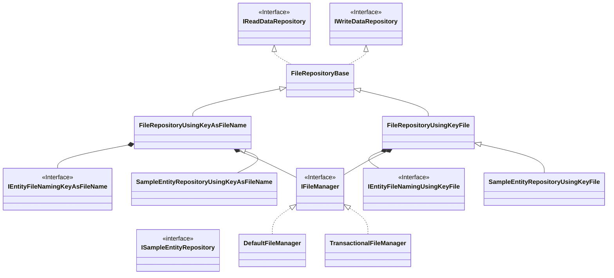
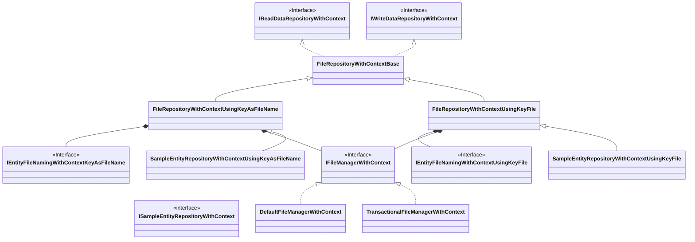

# Implementing filesystem repositories

- [Implementing filesystem repositories](#implementing-filesystem-repositories)
  - [Sample](#sample)
    - [Simple Repository](#simple-repository)
    - [Key file Repository](#key-file-repository)
  - [Class diagram](#class-diagram)
    - [Without context](#without-context)
    - [With context](#with-context)
  - [Base class](#base-class)
    - [FileRepositoryBase{TEntity, TKey} Class](#filerepositorybasetentity-tkey-class)
  - [Simple repository](#simple-repository-1)
    - [FileRepositoryUsingKeyAsFileName{TEntity, TKey} Class](#filerepositoryusingkeyasfilenametentity-tkey-class)
    - [IEntityFileNamingUsingKeyAsFileName\<TEntity, TKey\> interface](#ientityfilenamingusingkeyasfilenametentity-tkey-interface)
    - [IFileManager interface](#ifilemanager-interface)
  - [Key file Repository](#key-file-repository-1)
    - [FileRepositoryUsingKeyFile\<TEntity, TKey\> Class](#filerepositoryusingkeyfiletentity-tkey-class)
    - [IEntityFileNamingUsingKeyFile\<TEntity, TKey\> Interface](#ientityfilenamingusingkeyfiletentity-tkey-interface)
  - [Repositories with context](#repositories-with-context)


## Sample

### Simple Repository

This is a simple repository that uses the entity key value as the file name.

```console
d:\data\sampleentity
    b4124400-8d9f-4eb9-b6da-bf0128756763.json
    d3fee6e9-acf8-4600-86c4-7ef5aec3b734.json
    d65bdbab-7af8-452e-b1c0-50b1ca075948.json
```

```c#
var serializer = new SampleJsonSerializer();

// The DefaultFileManager class does not support transactions.
// If you require transactional control through TransactionScope, use the Transactional FileManager class instead.
var fileManager = new DefaultFileManager(serializer);

var dataDirectory = "d:\data\sampleentity"

// create a repository.
using var repo = new SampleEntityRepositoryUsingKeyAsFileName(dataDirectory, fileManager);

// get the entity with ID.
var entity = repo.Get(guid);

if (entity != null)
{
    Console.WriteLine($"Id:{entity.Id}, Code:{entity.Code}, Name:{entity.Name}");
}

var entity = new SampleEntity()
{
    Id = Guid.NewGuid(),
    Code = 3,
    Name = "item3"
};

// insert the entity.
repo.Insert(entity)
```

<details><summary>Implementing the SampleEntityRepositoryUsingKeyAsFileName class</summary>

```c#
/// <summary>
/// Repository for SampleEntity using the entity's key as the filename.
/// </summary>
internal class SampleEntityRepositoryUsingKeyAsFileName
    : FileRepositoryUsingKeyAsFileName<SampleEntity, Guid>, ISampleEntityRepository
{
    /// <summary>
    /// Creates a new instance.
    /// </summary>
    /// <param name="dataDirectory">The directory in which to save data files.</param>
    /// <param name="fileManager">The file manager.</param>
    internal SampleEntityRepositoryUsingKeyAsFileName(string dataDirectory, IFileManager fileManager)
        : base(dataDirectory, CreateEntityFileNaming(), fileManager, Encoding.UTF8)
    {
    }

    /// <summary>
    /// Creates the entity file naming logic.
    /// </summary>
    /// <returns>The entity file naming logic.</returns>
    private static IEntityFileNamingUsingKeyAsFileName<SampleEntity, Guid> CreateEntityFileNaming()
    {
        // ex) 350c9b44-8bd5-46af-b981-078892acfd90.json
        var fileNaming = EntityFileNaming.CreateKeyFileNameConverter(
            ".json",
            x => x.ToString(),
            x => Guid.Parse(x)
            );

        return EntityFileNaming.CreateUsingKeyAsFileName<SampleEntity, Guid>(
            x => x.ID!.Value,
            fileNaming
            );
    }
}
```

</details>

### Key file Repository

This is a repository that uses a key file to manage the paths of entity files.

```console
d:\data\sampleentity
    \keys
        b4124400-8d9f-4eb9-b6da-bf0128756763.key
        d3fee6e9-acf8-4600-86c4-7ef5aec3b734.key
        d65bdbab-7af8-452e-b1c0-50b1ca075948.key
    \entities
        00001_item1.json
        00002_item2.json
        00003_item3.json
```

The repository can be used just like the "Simple Repository" above. Only the file naming conventions differ.

```c#
var serializer = new SampleJsonSerializer();

// The DefaultFileManager class does not support transactions.
// If you require transactional control through TransactionScope, use the Transactional FileManager class instead.
var fileManager = new DefaultFileManager(serializer);

var dataDirectory = "d:\data\sampleentity"

// create a repository.
using var repo = new SampleEntityRepositoryUsingKeyFile(dataDirectory, fileManager);

// get the entity with ID.
var entity = repo.Get(guid);

if (entity != null)
{
    Console.WriteLine($"Id:{entity.Id}, Code:{entity.Code}, Name:{entity.Name}");
}

var entity = new SampleEntity()
{
    Id = Guid.NewGuid(),
    Code = 3,
    Name = "item3"
};

// insert the entity.
repo.Insert(entity)
```

<details><summary>Implementing the SampleEntityRepositoryUsingKeyFile class</summary>

```c#
/// <summary>
/// Repository for SampleEntity using key file.
/// </summary>
internal class SampleEntityRepositoryUsingKeyFile
    : FileRepositoryUsingKeyFile<SampleEntity, Guid>, ISampleEntityRepository
{
    /// <summary>
    /// Creates a new instance.
    /// </summary>
    /// <param name="dataDirectory">The data directory.</param>
    /// <param name="fileManager">The file manager.</param>
    internal SampleEntityRepositoryUsingKeyFile(string dataDirectory, IFileManager fileManager)
        : base(dataDirectory, CreateEntityFileNaming(), fileManager, Encoding.UTF8)
    {
    }

    /// <summary>
    /// Creates the entity file naming.
    /// </summary>
    /// <returns>The entity file naming.</returns>
    private static IEntityFileNamingUsingKeyFile<SampleEntity, Guid> CreateEntityFileNaming()
    {
        // ex) 350c9b44-8bd5-46af-b981-078892acfd90.key
        var keyFileNaming = EntityFileNaming.CreateKeyFileNameConverter(
            ".key",
            x => x.ToString(),
            x => Guid.Parse(x)
            );

        // ex) 00001_Entity1.json
        var entityFileNaming = EntityFileNaming.CreateEntityFileNameConverter<SampleEntity>(
            ".json",
            x => $"{x.Code:d5}_{x.Name}"
            );

        return EntityFileNaming.CreateUsingKeyFile<SampleEntity, Guid>(
            x => x.ID!.Value,
            keyFileNaming,
            entityFileNaming
            );
    }
}
```

</details>

## Class diagram

### Without context

Both the SampleEntityRepositoryUsingKeyAsFileName and SampleEntityRepositoryUsingKeyFile classes implement the ISampleEntityRepository interface, which I omitted to avoid imbalance in the diagram.



### With context



## Base class

### FileRepositoryBase{TEntity, TKey} Class

A basic implementation of a data repository using a file system.

* This constructor takes a directory in which to save data files.
* The methods for determining the file names that correspond to keys or entities, and for input and output of files, are abstract.

```c#
/// <summary>
/// Basic implementation of a data repository using a file system.
/// </summary>
/// <typeparam name="TEntity">The entity type.</typeparam>
/// <typeparam name="TKey">The key type.</typeparam>
public abstract class FileRepositoryBase<TEntity, TKey> : IReadDataRepository<TEntity, TKey>, IWriteDataRepository<TEntity>
{
    /// <summary>
    /// Creates a new instance.
    /// </summary>
    /// <param name="dataDirectoryPath">The directory in which to save data files.</param>
    protected FileRepositoryBase(string dataDirectoryPath)
    {
        DataDirectoryPath = PathEx.GetFullPath(dataDirectoryPath);
    }

    /// <summary>
    /// Gets the directory in which to save data files.
    /// </summary>
    public string DataDirectoryPath { get; }

    /// <inheritdoc/>
    public abstract bool UseTransactionScope { get; }

    /// <inheritdoc/>
    public void Dispose()
    {
        throw new NotImplementedException();
    }

    #region get

    /// <inheritdoc/>
    public TEntity? Get(TKey key)
    {
        var filePath = GetEntityFilePath(key);

        if (string.IsNullOrEmpty(filePath) || !File.Exists(filePath)) { return default; }

        return LoadFromFile(filePath!);
    }

    /// <inheritdoc/>
    public IEnumerable<TEntity> GetRange(IEnumerable<TKey> keys)
    {
        foreach (var key in keys)
        {
            var entity = Get(key);

            if (entity != null) { yield return entity; }
        }
    }

    /// <inheritdoc/>
    public IEnumerable<TEntity> GetAll()
    {
        foreach (var filePath in Directory.GetFiles(DataDirectoryPath, "", SearchOption.AllDirectories))
        {
            if (TryGetEntity(filePath, out var entity)) { yield return entity; }
        }
    }

    /// <inheritdoc/>
    public IEnumerable<TKey> GetAllKeys()
    {
        foreach (var filePath in Directory.GetFiles(DataDirectoryPath, "", SearchOption.AllDirectories))
        {
            if (TryGetKey(filePath, out var key)) { yield return key; }
        }
    }

    #endregion

    #region insert

    /// <inheritdoc/>
    public int Insert(TEntity entity)
    {
        var filePath = GetEntitySaveFilePath(entity);

        SaveToFile(entity, filePath);

        return 1;
    }

    /// <inheritdoc/>
    public int InsertRange(IEnumerable<TEntity> entities)
    {
        int count = 0;

        foreach (var entity in entities)
        {
            count += Insert(entity);
        }

        return count;
    }

    #endregion

    #region update

    /// <inheritdoc/>
    public int Update(TEntity entity)
    {
        var filePath = GetEntitySaveFilePath(entity);

        SaveToFile(entity, filePath);

        return 1;
    }

    /// <inheritdoc/>
    public int UpdateRange(IEnumerable<TEntity> entities)
    {
        int count = 0;

        foreach (var entity in entities)
        {
            count += Update(entity);
        }

        return count;
    }

    #endregion

    #region delete

    /// <inheritdoc/>
    public int Delete(TEntity entity)
    {
        var filePath = GetEntitySaveFilePath(entity);

        if (string.IsNullOrEmpty(filePath) || !File.Exists(filePath)) { return 0; }

        DeleteFile(filePath);

        return 1;
    }

    /// <inheritdoc/>
    public int DeleteRange(IEnumerable<TEntity> entities)
    {
        int count = 0;

        foreach (var entity in entities)
        {
            count += Delete(entity);
        }

        return count;
    }

    #endregion

    /// <summary>
    /// Gets the key that corresponds to the specified file path.
    /// </summary>
    /// <param name="filePath">The file path.</param>
    /// <param name="key">The identified Key.</param>
    /// <returns>Returns true if the key is identified, otherwise false.</returns>
    protected abstract bool TryGetKey(string filePath, out TKey key);

    /// <summary>
    /// Gets the entity that corresponds to the specified file path.
    /// </summary>
    /// <param name="filePath">The file path.</param>
    /// <param name="entity">The deserialized entity.</param>
    /// <returns>Returns true if the entity is deserialized, otherwise false.</returns>
    protected abstract bool TryGetEntity(string filePath, out TEntity entity);

    /// <summary>
    /// Gets the file path that corresponds to the specified key.
    /// </summary>
    /// <param name="key">The key.</param>
    /// <returns>The file path.</returns>
    protected abstract string? GetEntityFilePath(TKey key);

    /// <summary>
    /// Gets the file path where the specified entity will be saved.
    /// </summary>
    /// <param name="entity">The entity.</param>
    /// <returns>The file path.</returns>
    protected abstract string GetEntitySaveFilePath(TEntity entity);

    /// <summary>
    /// Loads the entity from the specified file.
    /// </summary>
    /// <param name="filePath">The file path.</param>
    /// <returns>The entity.</returns>
    protected abstract TEntity LoadFromFile(string filePath);

    /// <summary>
    /// Saves the specified entity to the specified file.
    /// </summary>
    /// <param name="entity">The entity.</param>
    /// <param name="filePath">The file path.</param>
    protected abstract void SaveToFile(TEntity entity, string filePath);

    /// <summary>
    /// Deletes the specified file.
    /// </summary>
    /// <param name="filePath">The file path.</param>
    protected abstract void DeleteFile(string filePath);
}
```


## Simple repository

This is a simple repository that uses the entity key value as the file name.

### FileRepositoryUsingKeyAsFileName{TEntity, TKey} Class

* Inherit from the FileRepositoryBase&lt;TEntity, TKey&gt; class.
* The entity file name is determined by an instance of a type that implements the IEntityFileNamingUsingKeyAsFileName&lt;TEntity, TKey&gt; interface.
* File I/O is handled by instances of types that implement the IFileManager interface.

```c#
public class FileRepositoryUsingKeyAsFileName<TEntity, TKey>
    : FileRepositoryBase<TEntity, TKey>
{
    public FileRepositoryUsingKeyAsFileName(
        string dataDirectoryPath,
        IEntityFileNamingUsingKeyAsFileName<TEntity, TKey> fileNaming,
        IFileManager fileManager,
        Encoding encoding
        )
    : base(dataDirectoryPath)
    {
        m_EntityFileNaming = fileNaming;
        m_FileManager = fileManager;
        m_Encoding = encoding;
    }

    // omission
}
```

### IEntityFileNamingUsingKeyAsFileName&lt;TEntity, TKey&gt; interface

This interface provides the functionality necessary to determine a file name from an entity's key value.

* In the SampleEntityRepositoryUsingKeyAsFileName class from the previous sample, the CreateEntityFileNaming method creates an object that implements this interface.

```c#
/// <summary>
/// Provides the functionality needed to use an entity's key as the filename.
/// </summary>
/// <typeparam name="TEntity">The entity type.</typeparam>
/// <typeparam name="TKey">The key type.</typeparam>
public interface IEntityFileNamingUsingKeyAsFileName<TEntity, TKey>
{
    /// <summary>
    /// Gets the key corresponding to the specified entity file name.
    /// </summary>
    /// <param name="entityFilePath">The entity file name.</param>
    /// <returns>The key.</returns>
    TKey? GetKeyFromFileName(string entityFilePath);

    /// <summary>
    /// Gets the entity file name corresponding to the specified key.
    /// </summary>
    /// <param name="key">The key.</param>
    /// <returns>The entity file name.</returns>
    string GetEntityFileName(TKey key);

    /// <summary>
    /// Gets the key for the specified entity.
    /// </summary>
    /// <param name="entity">The entity.</param>
    /// <returns>The key.</returns>
    TKey GetKey(TEntity entity);
}
```

### IFileManager interface

This is an interface that provides the functionality required for file input and output. This package contains the following two implementation classes.

* The DefaultFileManager class, included in the mxProject.Data.FileRepository package, uses classes in the System\.IO namespace of the .NET Standard library.

* The TransactionalFileManager class in the mxProject.Data.FileRepository.TxFileManager package uses [TxFileManager](https://github.com/chinhdo/txFileManager) to perform file I/O under transactional control using TransactionScope.
  * Complete transaction control like that of an RDB is not realized.
 
```c#
/// <summary>
/// Provides the functionality required to read and write files.
/// </summary>
public interface IFileManager
{
    /// <summary>
    /// Gets a value that indicates whether to use ambient transactions using TransactionScope.
    /// </summary>
    bool UseTransactionScope { get; }

    /// <summary>
    /// Loads the entity from the specified file.
    /// </summary>
    /// <typeparam name="TEntity">The entity type.</typeparam>
    /// <param name="filePath">The file path.</param>
    /// <param name="encoding">The encoding.</param>
    /// <returns>The entity.</returns>
    TEntity LoadFromFile<TEntity>(string filePath, Encoding encoding);

    /// <summary>
    /// Saves the specified entity to the specified file.
    /// </summary>
    /// <typeparam name="TEntity">The entity type.</typeparam>
    /// <param name="entity">The entity.</param>
    /// <param name="filePath">The file path.</param>
    /// <param name="encoding">The encoding.</param>
    void SaveToFile<TEntity>(TEntity entity, string filePath, Encoding encoding);

    /// <summary>
    /// Deletes the specified file.
    /// </summary>
    /// <param name="filePath">The file path.</param>
    void DeleteFile(string filePath);

    /// <summary>
    /// Writes the specified string to the specified file.
    /// </summary>
    /// <param name="filePath">The file path.</param>
    /// <param name="contents">The string.</param>
    /// <param name="encoding">The encoding.</param>
    void WriteAllText(string filePath, string contents, Encoding encoding);
}
```

## Key file Repository

This is a repository that uses a key file to manage the paths of entity files.

### FileRepositoryUsingKeyFile&lt;TEntity, TKey&gt; Class

* Inherit from the FileRepositoryBase&lt;TEntity, TKey&gt; class.
* The entity file name is determined by an instance of a type that implements the IEntityFileNamingUsingKeyFile&lt;TEntity, TKey&gt; interface.
* File I/O is handled by instances of types that implement the IFileManager interface.

```c#
public class FileRepositoryUsingKeyFile<TEntity, TKey>
    : FileRepositoryBase<TEntity, TKey>
{
    public FileRepositoryUsingKeyFile(
        string dataDirectoryPath,
        IEntityFileNamingUsingKeyFile<TEntity, TKey> fileNaming,
        IFileManager fileManager,
        Encoding encoding
    )
        : base(dataDirectoryPath)
    {
        m_EntityFileNaming = fileNaming;
        m_FileManager = fileManager;
        m_Encoding = encoding;
    }

    // omission
}
```

### IEntityFileNamingUsingKeyFile&lt;TEntity, TKey&gt; Interface

This interface provides the functionality required to manage entity file paths using a key file.

* In the SampleEntityRepositoryUsingKeyFile class from the previous sample, the CreateEntityFileNaming method creates an object that implements this interface.

```c#
/// <summary>
/// Provides the functionality required to manage entity file paths using key files.
/// </summary>
/// <typeparam name="TEntity">The entity type.</typeparam>
/// <typeparam name="TKey">The key type.</typeparam>
public interface IEntityFileNamingUsingKeyFile<TEntity, TKey>
{
    /// <summary>
    /// Gets a value indicating whether the specified file is a key file.
    /// </summary>
    /// <param name="filePath">The file path.</param>
    /// <returns>Returns true if it is a key file, otherwise false.</returns>
    bool IsKeyFile(string filePath);

    /// <summary>
    /// Gets a value indicating whether the specified file is an entity file.
    /// </summary>
    /// <param name="filePath">The file path.</param>
    /// <returns>Returns true if it is an entity file, otherwise false.</returns>
    bool IsEntityFile(string filePath);

    /// <summary>
    /// Gets the key corresponding to the specified key file name.
    /// </summary>
    /// <param name="keyFilePath">The key file name.</param>
    /// <returns>The key.</returns>
    TKey GetKeyFromFileName(string keyFilePath);

    /// <summary>
    /// Gets the key file name corresponding to the specified key.
    /// </summary>
    /// <param name="key">The key.</param>
    /// <returns>The key file name.</returns>
    string GetKeyFileName(TKey key);

    /// <summary>
    /// Gets the file path where the specified entity will be saved.
    /// </summary>
    /// <param name="entity">The entity.</param>
    /// <returns>The file path.</returns>
    string GetEntitySaveFileName(TEntity entity);

    /// <summary>
    /// Gets the key for the specified entity.
    /// </summary>
    /// <param name="entity">The entity.</param>
    /// <returns>The key.</returns>
    TKey GetKey(TEntity entity);
}
```

## Repositories with context

Other than adding context to method arguments, the concept is the same as the class above.

* Base class
  * FileRepositoryWithContextBase&lt;TEntity, TKey, TContext&gt; Class

* Simple repository
  * FileRepositoryWithContextUsingKeyAsFileName&lt;TEntity, TKey, TContext&gt; Class
  * IEntityFileNamingWithContextUsingKeyAsFileName&lt;TEntity, TKey, TContext&gt; Interface
  * IFileManagerWithContext&lt;TContext&gt; Interface

* Key file repository
  * FileRepositoryWithContextUsingKeyFile&lt;TEntity, TKey, TContext&gt; Class
  * IEntityFileNamingWithContextUsingKeyFile&lt;TEntity, TKey, TContext&gt; Interface
  * IFileManagerWithContext&lt;TContext&gt; Interface
